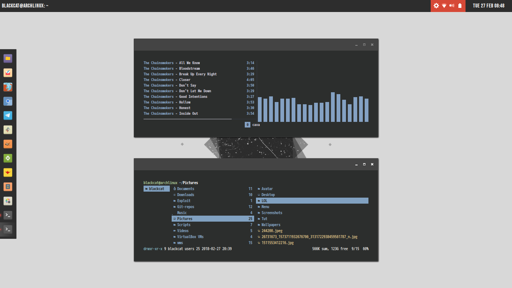
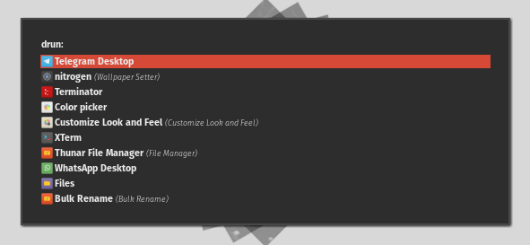

## Previews

- Openbox

- Windowchef

### Panel

- Tint2 

- Lemonbar

### Rofi

- Numix style

- Arc style

## Setup
- Dock: `plank`
- App Launcher: `rofi`
- File Manager: `ranger`
- Terminal Emulator: `rxvt-unicode`
- Text Editor: `geany`
- Music Player: `mpd`, `ncmpcpp` and `cava`

## Installed Apps

* `bum` -- A daemon that downloads album art for songs playing in `mpd`/`mopidy`.
* `cmus` -- A small ncurses based music player.
* `conky` -- Lightweight system monitor for X, can integrate with `dzen2`.
* `dunst` -- A customizable and lightweight notification-daemon.
* `feh` -- A fast and light image viewer to set wallpaper.
* `gpicview` -- A simple and fast image viewer for X.
* `lemonbar` -- A lightweight xcb based bar, this is a [fork](https://github.com/dark-yux/bar) that supports fontconfig and borders \w color.
* `mpc` -- Client for `mpd`, responsible for telling lemonbar about the currently playing media.
* `mpd` -- A daemon for playing music of various formats with `ncmpcpp` as client.
* `mpdviz` -- Client for `mpd` to display visualizer.
* `nvim` -- Modern text editor based on `vim`.
* `polybar` -- A fast and easy-to-use tool status bar.
* `ranger` -- A vim inspired filemanager for console.
* `redshift` -- Adjusts the color temperature of your screen according to your surroundings.
* `ruler` -- A window rule daemon like `bspwm`.
* `sxhkd` -- Simple X hotkey daemon with a powerful and compact configuration syntax.
* `tmux` -- Terminal multiplexer.
* `vim` -- Vi Improved, a highly configurable, improved version of the vi text editor.
* `xtitle` -- Outputs X window titles to show current window title on `lemonbar`.
* `xdotool` -- Command-line X11 automation tool to show workspace status.

## :octocat: Credits

* Thanks to [tudurom](https://github.com/tudurom/) and [yuune](https://github.com/yuune) for references.
* [Linuxer Desktop Art](https://web.facebook.com/groups/linuxart/), [Eye Candy Linux](https://plus.google.com/communities/104794997718869399105) and r/unixporn.
* And another user for sharing their dotfiles.
