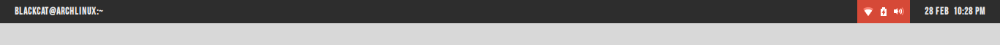
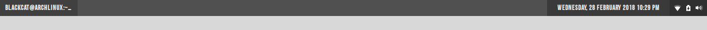
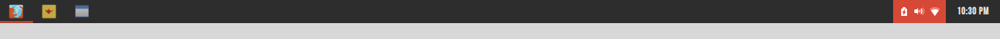
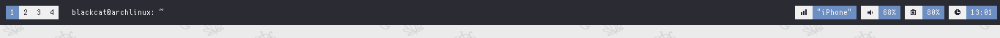
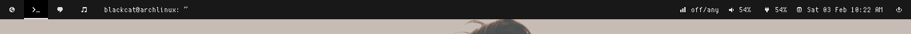
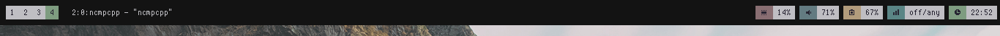
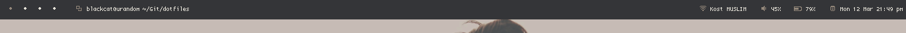

### About
Currently, i am using openbox (Groove) and windowchef (setup not ready) and this is the list of apps contained on my setup.

- Shell: `fish`
- Dock: `plank`
- App Launcher: `rofi`
- File Manager: `ranger`
- Terminal Emulator: `rxvt-unicode`
- Text Editor: `vim`
- Music Player: `mpd` and `ncmpcpp`
- Visualizer: `cava`

## Previews

### Openbox

Theme: Numix GNOME styled.

Theme: Groove

### Windowchef

Theme: pebble

Theme: Frost

Theme: Adapta

## Panel

### Tint2 

### Lemonbar
==========

### Polybar

## Rofi

### Numix

### Arc

## :octocat: Credits

* Thanks to [tudurom](https://github.com/tudurom/) and [yuune](https://github.com/yuune) for references.
* [Linuxer Desktop Art](https://web.facebook.com/groups/linuxart/), [Eye Candy Linux](https://plus.google.com/communities/104794997718869399105) and r/unixporn.
* And another user for sharing their dotfiles.
