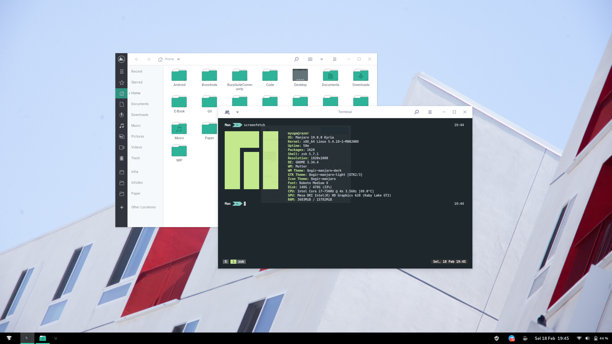
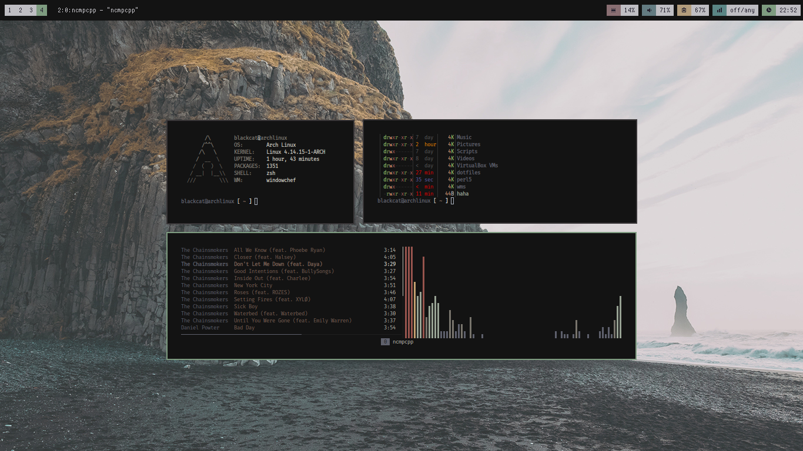

  

About
=====

Currently setup on **Manjaro Linux**:

- Panel: `dash to panel`
- Shell: `zsh`
- Text Editor: `atom` and `vim`
- Icons: `Qojir-manjaro`
- Terminal Emulator: `gnome-terminal`
- Terminal Fonts: `Menlo`
- Terminal Themes: `Material`

**gnome-shell** with `Material` themes.

2 years ago, i am using `openbox-rounded`, `windowchef` as windows manager and this is the list of apps contained on my old setup.

- Panel: `polybar` and `tint2`
- Shell: `zsh`
- App Launcher: `rofi` and `dmenu`
- Music Player: `mpd` and `ncmpcpp`
- Text Editor: `vim` and `geany`
- Terminal Emulator: `rxvt-unicode`

**openbox-rounded** with `Numix` themes.

**windowchef** with dark mode.

Collections
=====

**NOTE** : for wallpaper, you can see on `img/wall`.

:octocat: Credits
=====

- [Linuxer Desktop Art](https://web.facebook.com/groups/linuxart)
- [Dotfiles Indonesia](https://t.me/dotfiles_id)
- [Eye Candy Linux](https://plus.google.com/communities/104794997718869399105)
- `r/unixporn`.
