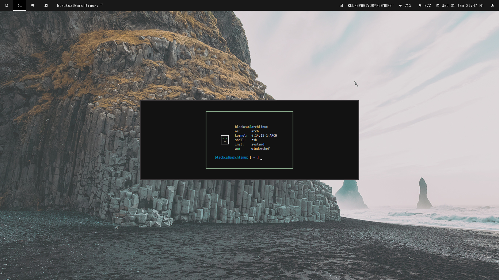
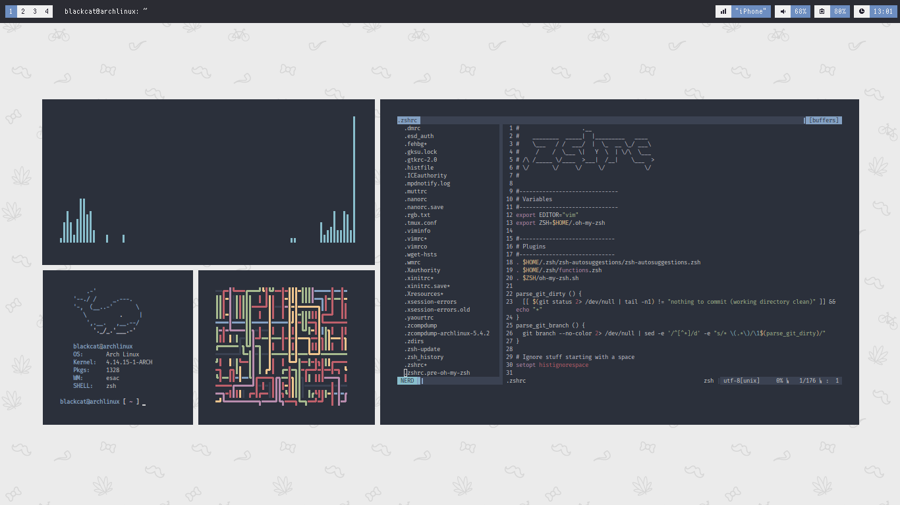

```

						 	 ___   ___ _____ ___ ___ _    ___ ___ 
							|   \ / _ \_   _| __|_ _| |  | __/ __|
							| |) | (_) || | | _| | || |__| _|\__ \
							|___/ \___/ |_| |_| |___|____|___|___/
                                      

```

Welcome to my Archlinux configuration for windowchef.

Screenshots
===============





Tables of Contents
====================
- [Introduction](#dotfiles)
- [Installation](#managing)
- [Configuration](#installing)
- [Installed apps](#how-it-works)
- [Housekeeping](#tldr)
- [TODO](#my-shell)
- [Credits](#vim)


Introduction
===============

What is `windowchef`? windowchef is stacking window manager written in C with the help of the XCB library,
using `waitron` as sends commands to windowchef through X client messages created by .
How about keybind? windowchef use a third party program like `sxhkd` to send pointer events to `waitron` using keyboard.

Installation
===============

Before installing, you must install some dependencies for windowchef :
* `xcb`
* `xcb-randr`
* `xcb-util-wm`
* `xcb-keysyms`
* `xproto (compile-time dependency)``

Windowchef also available on `AUR` :
* `windowchef`
* `windowchef-git`

Or install it from source using git clone and `make` it!
1. `git clone https://github.com/tudurom/windowchef.git`
2. `cd windowchef`
3. `make && sudo make install`

Configuration
===============

1. `mkdir $HOME/.config/windowchef`
2. `cp windowchef/examples/windowchefrc $HOME/.config/windowchef`
3. `cp windowchef/examples/sxhkdrc $HOME/.config/sxhkd`
4. Then set permission to executable using `chmod +x`.

Installed Apps
===============

* `bum` -- A daemon that downloads album art for songs playing in `mpd`/`mopidy`.
* `cmus` -- A small ncurses based music player.
* `conky` -- Lightweight system monitor for X, can integrate with `dzen2`.
* `dunst` -- A customizable and lightweight notification-daemon.
* `feh` -- A fast and light image viewer to set wallpaper.
* `gpicview` -- A simple and fast image viewer for X.
* `lemonbar` -- A lightweight xcb based bar, this is a  that supports fontconfig and borders \w color.
* `mpc` -- Client for `mpd`, responsible for telling lemonbar about the currently playing media.
* `mpd` -- A daemon for playing music of various formats with `ncmpcpp` as client.
* `mpdviz` -- Client for `mpd` to display visualizer.
* `nvim` -- Modern text editor based on `vim`.
* `polybar` -- A fast and easy-to-use tool status bar.
* `ranger` -- A vim inspired filemanager for console.
* `redshift` -- Adjusts the color temperature of your screen according to your surroundings.
* `ruler` -- A window rule daemon like `bspwm`.
* `sxhkd` -- Simple X hotkey daemon with a powerful and compact configuration syntax.
* `tmux` -- Terminal multiplexer.
* `vim` -- Vi Improved, a highly configurable, improved version of the vi text editor.
* `xtitle` -- Outputs X window titles to show current window title on `lemonbar`.
* `xdotool` -- Command-line X11 automation tool to show workspace status.


TODO
===============
* Chnager desktop themes for windowchef.
* User Guide.

Credits
===============
* Thanks to .
* Ruka Nanda Vera  for references.
* Linuxer Desktop Art, Eye Candy Linux and r/unixporn.
* And another user to sharing their dotfiles.
