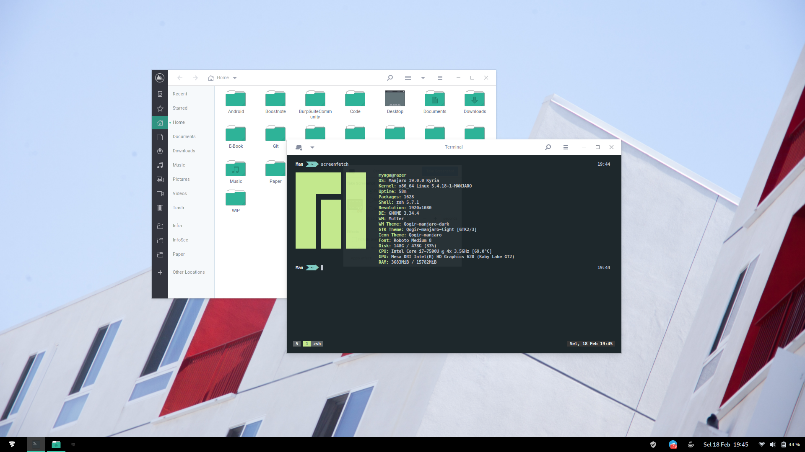
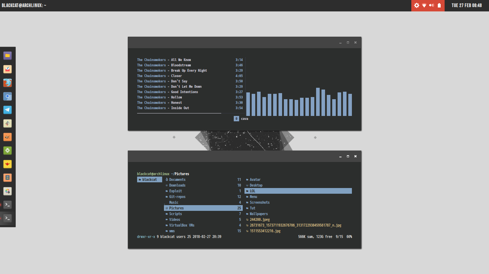
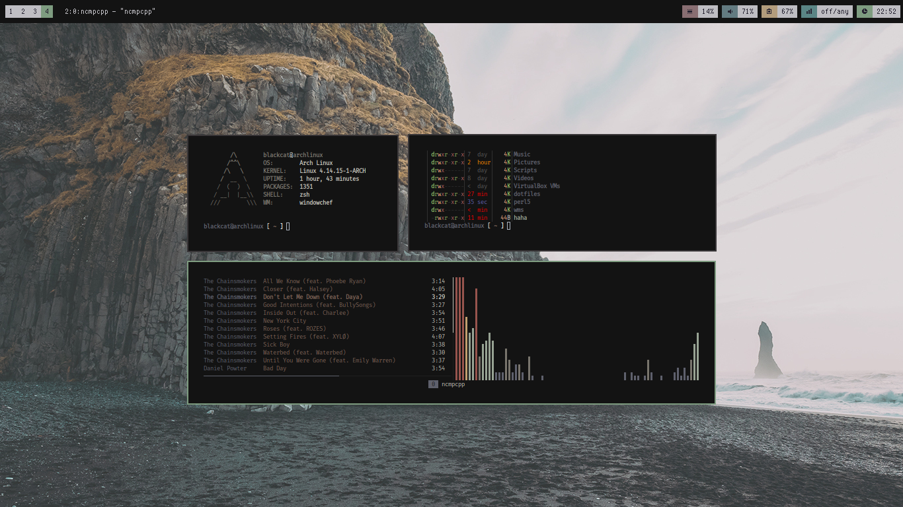
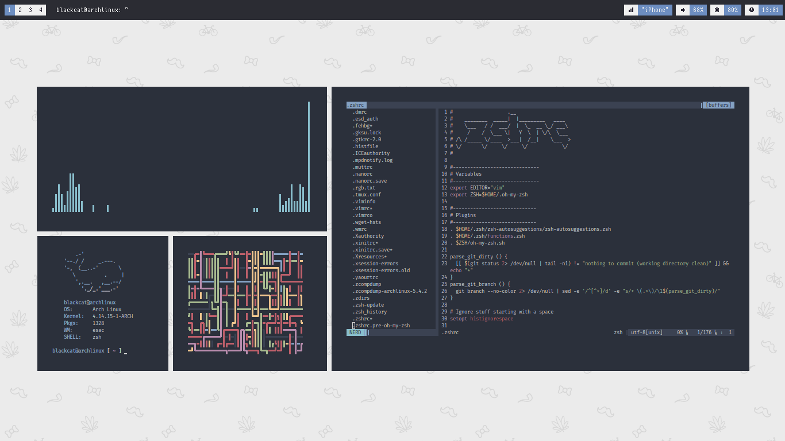
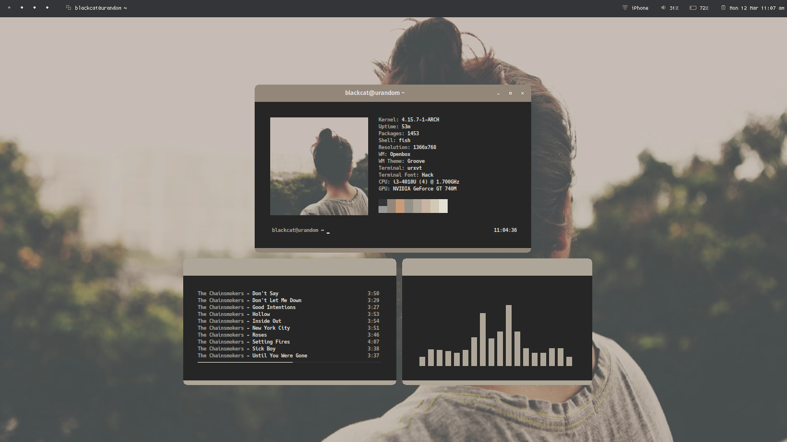

<p align="center">
  
</p>

macOS setup (current)
=====

Daily driver is now a Mac. See [`macos/README.md`](macos/README.md) for the
full replicate-from-scratch guide (Homebrew bundle, apps, fonts, system
defaults). Individual pieces:

- [`macos/`](macos/) — Brewfile (CLI tools, fonts, GUI apps, VS Code
  extensions), `defaults write` settings
- [`zsh/`](zsh/) — Oh My Zsh + Powerlevel10k
- [`git/`](git/) — `.gitconfig`, global gitignore
- [`nvim/`](nvim/) — NvChad-based Neovim config
- [`iterm2/`](iterm2/) — profile, colors, fonts (Space Mono + JetBrains Mono Nerd Font)
- [`obsidian/`](obsidian/) — vault settings for the Personal/Professional vaults

```sh
git clone https://github.com/myugan/dotfiles ~/dotfiles
cd ~/dotfiles
./install.sh
```

Old Manjaro Linux setup (archived, still below)
=====

Everything below — the Ansible playbook, window manager configs, `templates/`
— is the previous Linux setup. Kept for history, not maintained against the
current machine.

About
=====

Currently setup on **Manjaro Linux**:

- Panel: `dash to panel`
- Shell: `zsh`
- Text Editor: `atom`, `vim`, and `neovim` (see [`templates/home/.config/nvim`](templates/home/.config/nvim/README.md) for setup + shortcuts)
- Icons: `Qojir-manjaro`
- Terminal Emulator: `gnome-terminal`
- Terminal Fonts: `Menlo`
- Terminal Themes: `Material`

**gnome-shell** with `Material` themes.



2 years ago, i am using `openbox-rounded`, `windowchef` as windows manager and this is the list of apps contained on my old setup.

- Panel: `polybar` and `tint2`
- Shell: `zsh`
- App Launcher: `rofi` and `dmenu`
- Music Player: `mpd` and `ncmpcpp`
- Text Editor: `vim` and `geany`
- Terminal Emulator: `rxvt-unicode`

**openbox-rounded** with `Numix` themes.



**windowchef** with dark mode.



Installation
=====

### Requirements
- `ansible`
- `python3`


```
git clone https://github.com/myugan/dotfiles
cd dotfiles
ansible-playbook -i hosts -e "user=example" main.yml
```

Collections
=====





**NOTE** : for wallpaper, you can see on `img/wall`.

:octocat: Credits
=====

- [Linuxer Desktop Art](https://web.facebook.com/groups/linuxart)
- [Dotfiles Indonesia](https://t.me/dotfiles_id)
- [Eye Candy Linux](https://plus.google.com/communities/104794997718869399105)
- `r/unixporn`.
