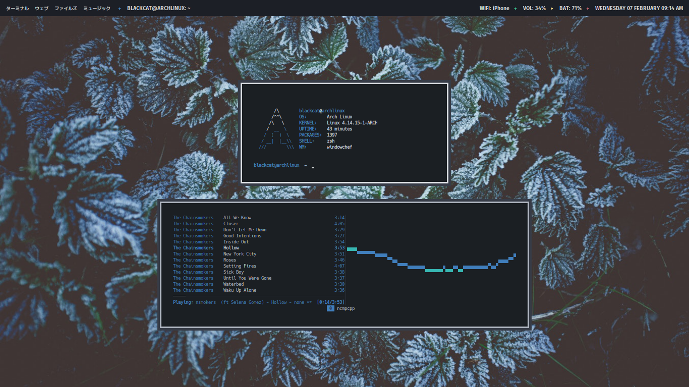
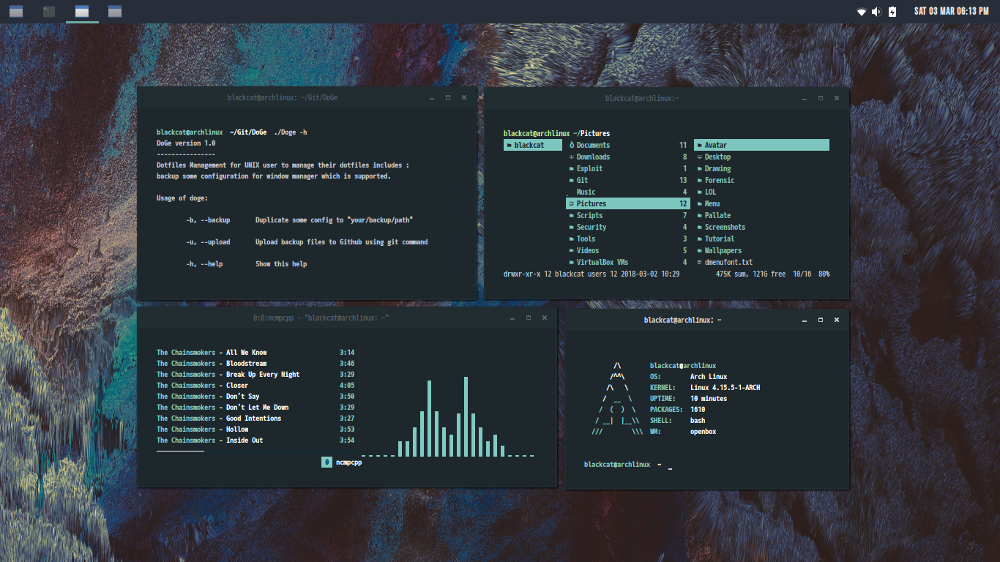

DOTFILES
=========

About
=========
Currently, i am using openbox (Groove) and windowchef (setup not ready) and this is the list of apps contained on my setup.

+ Shell: `fish`

+ Dock: `plank`

+ App Launcher: `rofi`

+ File Manager: `ranger`

+ Terminal Emulator: `rxvt-unicode`

+ Text Editor: `vim`

+ Music Player: `mpd` and `ncmpcpp`

+ Visualizer: `cava`

Previews
=========

**openbox** Numix GNOME styled.

.. image:: img/numix.png

**openbox** - Groove + Monokai.

.. image:: img/groove.png

**windowchef** - old stuff.

.. image:: img/pebble.png

**windowchef** - frost.

**windowchef** - Adapta theme adapted!

=========
:octocat: Credits
=========

+ Thanks to .. _tudurom: https://github.com/tudurom/ and .. _yuune: https://github.com/yuune for references.

+ .. _Linuxer Desktop Art: https://web.facebook.com/groups/linuxart, .. _Eye Candy Linux: https://plus.google.com/communities/104794997718869399105 and r/unixporn_.
